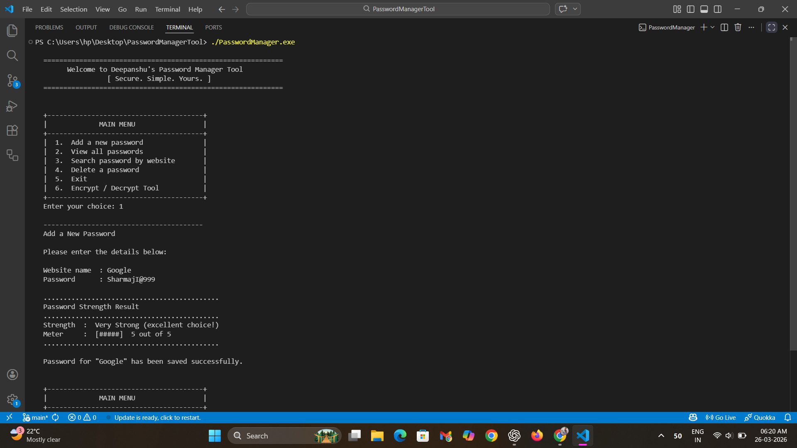
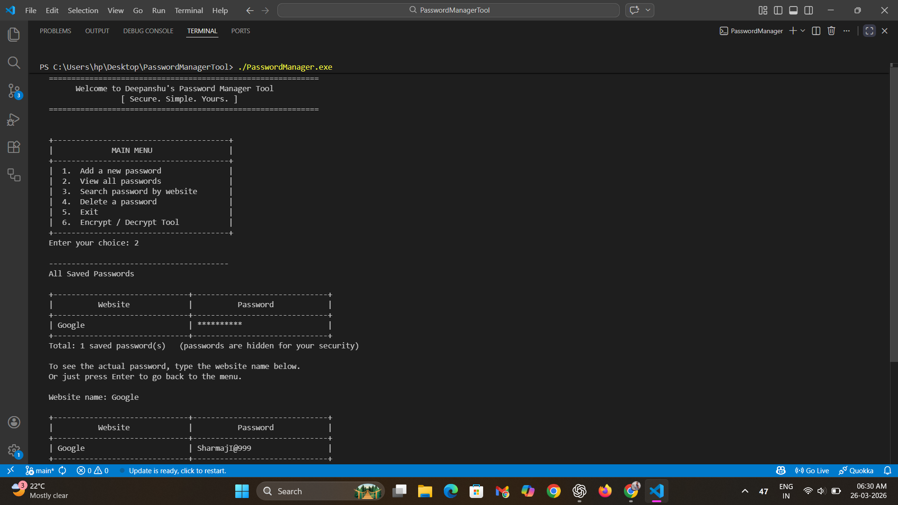
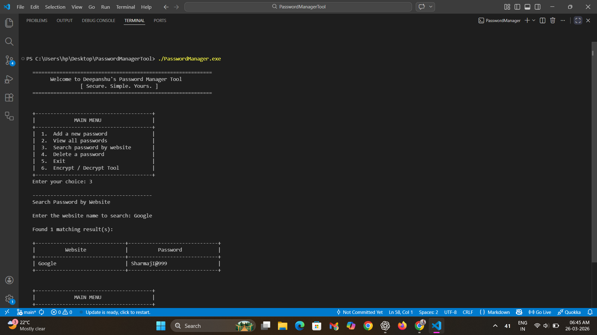
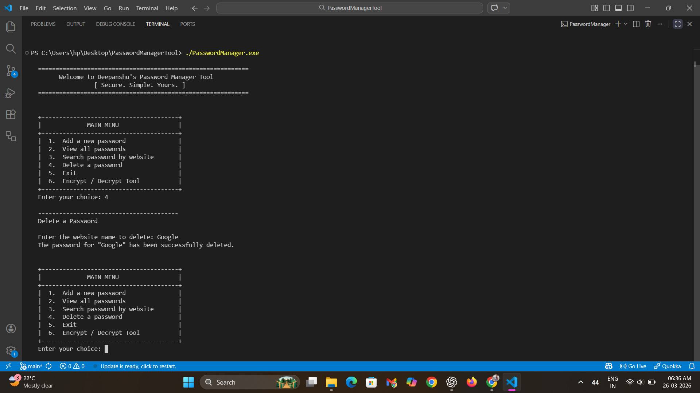
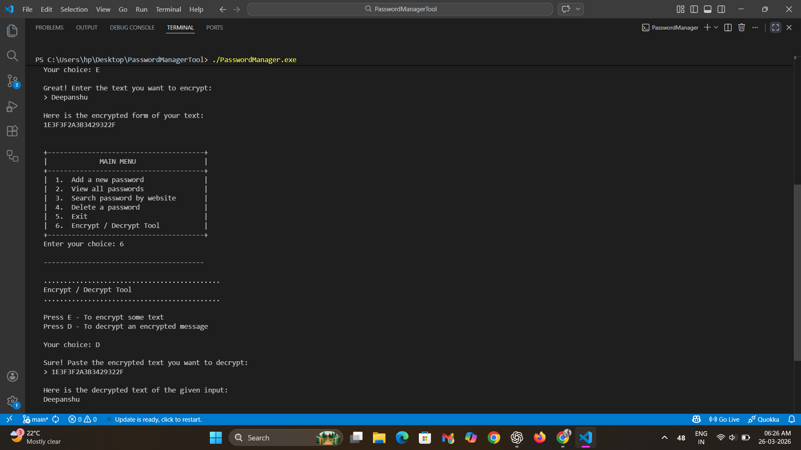
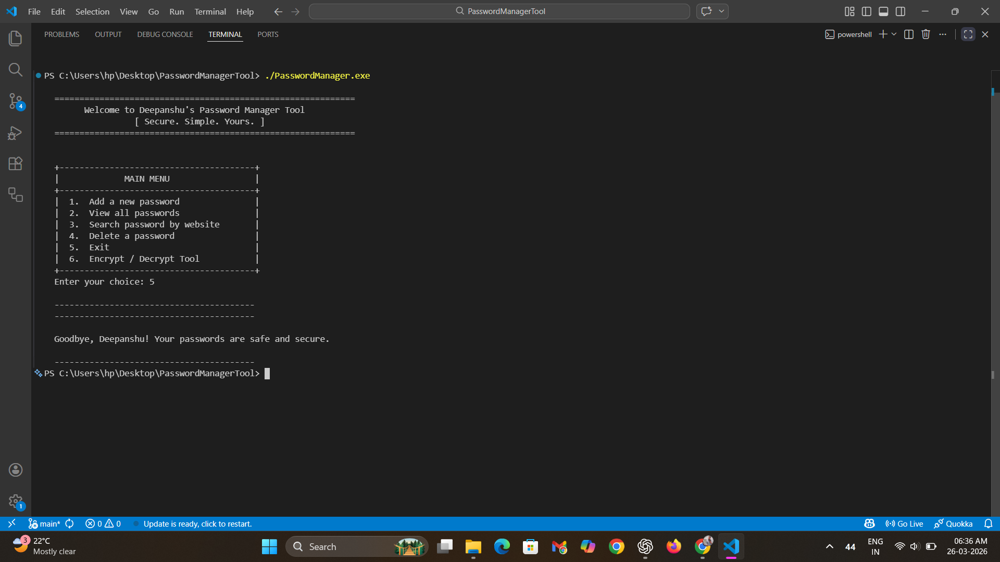

# 🔐 Password Manager Tool


A secure, console-based **Password Manager Tool** built in C++ that stores credentials locally using encryption.  
Designed with a focus on simplicity, privacy, and core system design concepts.

## 📌 Overview
- Stores passwords securely using **XOR encryption**
- Works completely **offline (no cloud)**
- Clean and interactive **menu-driven CLI**

## ✨ Features
- 🔒 **Secure Storage** – Encrypts and saves data in `passwords.dat`
- 📊 **Password Strength Analyzer** – Checks strength + gives suggestions
- 👁️ **Masked Display** – Passwords hidden by default
- 🔍 **Smart Search** – Search by exact website name
- ❌ **Delete Functionality** – Remove saved entries
- 🚫 **Duplicate Prevention** – Avoids overwriting existing data
- 🔄 **Encrypt/Decrypt Tool** – Manual text encryption utility
- 💾 **Auto Save** – Loads & saves automatically

## 🚀 Advantages
- 🖥️ **100% Offline & Private** – No external servers
- ⚡ **Lightweight** – Pure C++ (no frameworks)
- 🧑‍💻 **User-Friendly CLI** – Simple and intuitive menus
- 🛡️ **Security Awareness** – Warns for weak passwords

## 🛠️ Tech Stack
- **Language:** C++
- **Concepts:** OOP, File Handling, STL

**📚 Libraries Used:**
- iostream, fstream, string, vector  
- algorithm, cctype, limits, sstream  

## 📂 Project Structure
```
PasswordManager/
│── main.cpp
│── PasswordManager.cpp
│── PasswordManager.h
│── .gitignore
│── README.md
```

## 💻 Sample Session
```
 ============================================================
        Welcome to Deepanshu's Password Manager Tool
                  [ Secure. Simple. Yours. ]
  ============================================================


  +---------------------------------------+
  |             MAIN MENU                 |
  +---------------------------------------+
  |  1.  Add a new password               |
  |  2.  View all passwords               |
  |  3.  Search password by website       |
  |  4.  Delete a password                |
  |  5.  Exit                             |
  |  6.  Encrypt / Decrypt Tool           |
  +---------------------------------------+
  Enter your choice: 
```  

## 🖼️ Screenshots

### ➕ Add Password
  
*Allows users to securely add and store new credentials.*

### 📋 View Passwords
  
*Shows all saved entries with passwords masked for security.*

### 🔍 Search Password
  
*Enables users to search for stored credentials by website name.*

### ❌ Delete Password
  
*Provides an option to remove saved credentials permanently.*

### 🔄 Encrypt / Decrypt Tool
  
*Allows manual encryption and decryption of custom text.*

### 🚪 Exit
  
*Safely exits the application after completing all operations.*

## 📦 Setup & Installation

### 1. Clone
```bash
git clone https://github.com/deepanshu1420/PasswordManagerTool.git
cd PasswordManagerTool
```

### 2. Compile (via Terminal in VS Code)
```bash
g++ main.cpp PasswordManager.cpp -o PasswordManager
```
👉 This will create an executable file (.exe):
- On Windows: `PasswordManager.exe`
- On Mac/Linux: `PasswordManager`

### 3. Run (via Terminal in VS Code)
```bash
./PasswordManager.exe
```
